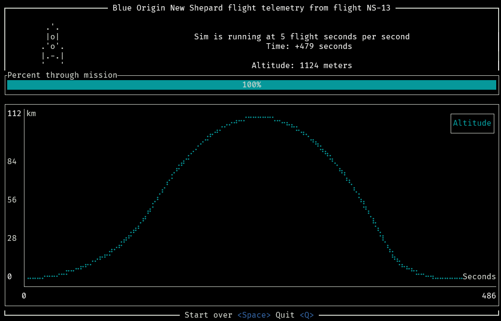

# Blue Telemetry Tui

A terminal user interface for the Blue Origin flight telemetry from the launch of the New Shepard flight on October 13 2020.

Data is courtesy of nasa.gov and the download link is below. This project uses the `truth.csv` file for its telemetry data.

## Data

This app used the `truth.csv` app for its data. The only changes that were made were some row removals from before and after the flight to get to the action sooner.

## Flight Facts

New Shepard flight on October 13 2020. Apogee 107.0 Km (66.52 mi)
Launched from West Texas at an altitude around 3700 ft

Max altitude of PM ~100 km
Max vertical velocity ~900 m/s
Total flight time of PM ~7.5 min
Landed at Blue Origin’s landing pad, ~3.3 km (~2 mi) from the launch site

lift off 7.26 seconds in
max Q at 73.23 s
meco at 143.49
sep at 163.26
apogeee at 246.6 and 106,744 m

## ToDos

- [x] Convert ecef coordinates to Geo
- [ ] Spread out the widgets [docs](https://ratatui.netlify.app/book/concepts/layout/)
- [ ] Show graph of altitude
- [ ] Show graph of velocity
- [ ] Speed up or slowdown playback based on user input
- [ ] Convert ecef algo conversion to [Olson's](https://github.com/planet36/ecef-geodetic/blob/main/olson_1996/olson_1996.c) and check performance measures
- [ ] Convert csv read into async streaming with [csv_async](https://docs.rs/csv-async/latest/csv_async/)

## Links

- [Data Download Link](https://data.nasa.gov/Aerospace/Deorbit-Descent-and-Landing-Flight-1-DDL-F1-/vicw-ivgd/about_data)
- [Project description](https://techport.nasa.gov/projects/116144)
- [Powerpoint about mission](https://ntrs.nasa.gov/api/citations/20210021279/downloads/FY21%20GCD%20APR%20-%20Blue%20Origin%20DDL%20Tipping%20Point-20210914%20(2).pptx.pdf)
